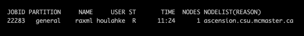

## Lab # 1 - Introduction to Linux and Slurm

## Table of Contents
1. [Introduction](#intro)
2. [The Terminal Client and the Remote Server](#terminal)
3. [Login & Home Directory](#login)
4. [Basic Linux](#basic)
5. [File Manipulation](#files)
6. [Process Management](#processes)
7. [Introductory Sequence Informatics](#seq)

<a name="intro"></a>
## Introduction

The goal of this lab is to introduce the Linux operating system, the *command line* and slurm, in the context of file manipulation and Sanger DNA sequencing informatics.

**Flash Updates**
* *Linux* 
* *Slurm* 
* *FASTA* 

**Computer Resources**
* We will be using the Faculty of Health Science Computational Cluster
* This is the same cluster that supports computational health science research at McMaster

**Grading**
* This is a participation lab, not graded.
* An answer key will be provided on A2L after the deadline.

<a name="terminal"></a>
## The Terminal Client and the Remote Server

> Flash Update - Linux 

Today’s lab will be performed almost exclusively at the command line and is meant to be an introduction to command line thinking. It will also introduce *Slurm*, an open-sourced job scheduler used to manage and monitor multiple tasks on high-performance compute systems.

**NOTE 1: Case matters for linux computers. Unless otherwise indicated, use lowercase.**

<a name="login"></a>
## Login, Logout & Home Directory

To login into the course server, we are going to use secure shell (ssh), which is an encrypted connection between machines:

```bash
ssh -l <macid> acf-access-student.csu.mcmaster.ca
```

> Note: the server is behind the McMaster firewall and requires VPN to connect from off campus or from the MacSecure wireless network , https://uts.mcmaster.ca/services/computers-printers-and-software/virtual-private-networking/

To logout of the course server:

```bash
exit
```

It is always good practice to *exit* an ssh session because it ensures that all running processes associated to the ssh session are closed/ended.

> Linux tip: use of the up arrow on your keyboard to bring back the previous command. Try this now to login to the server again.

When you first login, you will see the welcome screen, which varies for each computer. In linux, this home directory is described as below were `macid` is your MacID:

> /workspace/lab/studentlab/macid

LINUX has a directory hierarchy designated by the use of the slash (/) symbol.  The directory above is given as an absolute path (the exact location in the directory hierarchy).  If you ever need to confirm your exact location in the directory hierarchy, use:

```bash
pwd
```

If you ever want to quickly get back to your home directory, use:

```bash
cd ~
```

The tilde is a LINUX symbol meaning *my home directory*.  Thus, the following two commands would both move you to your home directory:

```bash
cd /workspace/lab/studentlab/macid
cd ~
```

Note that the command line prompt shows your current location relative to your home directory, e.g. *macid@acf-access-student:~$*

The *echo* command tells the computer to print things to screen.

```bash
echo "Hello World"
echo "How are you?"
```

The "#" symbol tells the computer to ignore the text that comes after it. You can use the "#" symbol to add comments to your code to explain what each step is doing. What happens when you try the following code?

```bash
# Testing adding comments and "commenting code out"
# echo "Hello World"
echo "How are you?"
```

<a name="basic"></a>
## Basic Linux

Ok, let’s start the demo.  Change to the lab 1 directory and list the contents:

```bash
cd /workspace/lab/studentlab/lab1_linux
ls
```

The list command (*ls*) by default just gives a list of file names. For details, you want to add flags:

```bash
ls -la
```

Now you get detailed information for each file, plus see all the normally hidden system files.  To learn about flags for any program, use the *man* command.  To learn about *ls*, use (try space and b to move about, and q to exit):

```bash
man ls
```
 
Flags can be used in an order, thus these two commands are the same:

```bash
ls -la
ls -al
```

Let's move back to our home directory. This is where we will store all the outputs for the labs. Let's also make a new directory to store the outputs of Lab 1 to keep our outputs organized.

```bash
cd ~
mkdir lab1_linux
```

Let’s see the results:

```bash
ls
```

Ok, move into your lab 1 directory and confirm your location in the directory structure:

```bash
cd lab1_linux
pwd
```

Here are the three ways you could return to your home directory. Try moving in and out of `lab1_linux`:

```bash
cd ~/lab1_linux
cd ../lab1_linux
cd /workspace/lab/studentlab/macid/lab1_linux
```

The first is your shortcut to your home directory. The second example uses relative paths as *..* means up one directory. The third example uses absolute paths.

<a name="files"></a>
## File Manipulation

Now we are going to work with some data, but first everyone should move into their own personal directory:

```bash
cd /workspace/lab/studentlab/macid/lab1_linux
pwd
```

Are you in your own directory? If not, ask for help. 

For a moment, open your web browser and look up accession LVLB01000014 in GenBank (http://www.ncbi.nlm.nih.gov). Now lets try the same thing at the command line using a Perl script written by Dr. McArthur:

```bash
/workspace/lab/studentlab/lab1_linux/gb2fasta LVLB01000014
```

Unfortunately, the output scrolled down the screen too fast, so lets redirect the output to file. The redirect *>* will take the screen output of any command and save it as a file:

```bash
/workspace/lab/studentlab/lab1_linux/gb2fasta LVLB01000014 > test.fa
ls
```

Did you see the new file in your directory? Let’s look at the contents:

```bash
cat test.fa
```

Blurred by didn’t it? *cat* stands for concatenate and rapidly takes you to the end of a file. Your other option is to use the *more* command:

```bash
more test.fa
```

Now the screen pauses. Here are the controls for *more*:

> enter (down one line)

> space (down a page)

> b (back a page)

> / (search for text)

> q (quit)

While using *more*, try to search for a start codon when using more by entering:

> /ATG

The *more* command will search for that string in the text and go straight to it, but it can be a little confusing because it does not highlight exactly where that text is. Some bioinformaticians may use the alternate command *less*. It is almost identical to *more*, but has more options. Thus, less is more and more is less. Welcome to the painful humour of linux users.

```bash
less test.fa
```

Try again now to search for the start codon using the same keys as above. As you can see, the *less* command will highlight each area that there is a possible start codon (except where they wrap around the end of a line).

Now make a new directory called *mydata* to store *test.fa* in:

```bash
mkdir mydata
ls
```

> Linux tip: if you're tired of typing 'test.fa', we've got a solution! After you type a command (e.g., *cp*) type out the first (few) letters of an existing file/directory name, then click the tab button on your keyboard to fill out the entire file/directory name for you! Try it in this next step!

You can place a copy of *test.fa* in that directory:

```bash
cp test.fa mydata/test.fa
```

Use *ls* to see both copies:

```bash
ls
ls mydata
```
 
Note that all of the following copy commands would have done the same thing:

```bash
cp test.fa mydata/test.fa
cp test.fa mydata/.
cp test.fa ./mydata/.
cp test.fa /workspace/lab/studentlab/macid/lab1_linux/mydata/.
```

A single dot means *same* or *current*, so the second example means to copy using the same name. The third example explicitly tells linux that the directory *mydata* is in my current location and then to copy using the same name.  

*./* is an example of relative paths and is usually implied in most commands (such as the first two examples), but sometimes you need to explicitly use it. The last example performs the command using the absolute path.

Note that you could have copied and renamed at the same time. Try the example below:

```bash
cp test.fa mydata/baddata.fa
ls mydata
```

Also, you could have just moved the *test.fa* file instead of copying it:

```bash
mv test.fa mydata/baddata2.fa
ls
ls mydata
```

Ok, move into the *mydata* directory and confirm your location in the directory structure:

```bash
cd mydata
pwd
```

Now for the linux concept of *pipes*. Try the following:

```bash
cat baddata2.fa | more
```

The vertical line is called a pipe. The results of *cat* are piped to *more*. *cat* attempts to spit out the entire contents of *baddata2.fa* to the screen, but *more* pauses it. Using pipes (you can use many on one line), you can combine linux programs to do very tricky things.  

Ok, let’s clean things up by moving to our working directory and removing the files we’ve created:

```bash
cd ~/lab1_linux
ls
```

Try to remove the mydata directory:

```bash
rm mydata
```

It didn’t work, did it? Use the man page to help figure out a command to remove this directory:

```bash
man rm
```

**Question #1. What command did you use to remove this non-empty directory?**

<a name="processes"></a>
## Process Management

> Flash Update - Slurm

You have now learned the basics of file manipulation. The server that you are working with can run many processes at once. However, to ensure that the process one by own person does not interrupt the process run by another person, it is helpful to have a system that can manage workload and assign resources to each task. This is where *Slurm* comes in. *Slurm*, an open-sourced job scheduler used to manage and monitor multiple tasks on high-performance compute systems.

To submit a job to the *Slurm* scheduler, the command needs to be included in a slurm script with parameters telling *Slurm* what resources the task needs.

We can create a new file using the command `nano`. First let's make sure we are in our lab 1 directory. 

**Note:** You can use `#` to add "comments" that the computer will ignore. This allows you to add documentation on what each line of code is doing.

```bash
# make sure we are in our lab 1 directory
cd ~/lab1_linux
# create new file
nano test_slurm.sbatch
```
Copy the following into the file:

```bash
#!/bin/bash
#SBATCH --job-name=jobname
#SBATCH --time=00:20:00
#SBATCH --partition=classroom
#SBATCH --ntasks=1
#SBATCH --mem=2G

# include command you want to run
/workspace/lab/studentlab/lab1_linux/gb2fasta LVLB01000014 > test.fa
```

To save and close the file, hit `Ctrl-X` followed by `Y`. 

| Parameter | Description | 
| --- | --- |
| --job-name | Name of the job that will show in the Slurm queue | 
| --time | Maximum length of time job will run for (format = days-hours:minutes:seconds). For example, to request the job to run for 2 days, you can either request 48 hours (`--time=48:00:00`) or 2 days (`--time=2-00:00:00`)   |
| --partion | This tells slurm which resources to use. Please always keep this set to `classroom` | 
| --ntasks | This should reflect the number of threads a tool is using. If you are only requesting one thread but the tool is using more it will affect the performance of other jobs running on the same node. This will become important when running RaxML in Lab 3. | 
| --mem | The amount of memory the job needs. | 

The command can then be submitted to the *Slurm* scheduler using the *sbatch* command.

```bash
sbatch test_slurm.sbatch
```

Alternatively, you can request a compute node to work interactively. This is helpful if you are developing code that you want to interate on and isn't ready to just run in the background yet. To request an interactive node, run the following:

```Bash
salloc --mem=2G --time=24:00:00 --partition=classrom
srun --pty bash
```

To test which node you are on, you can run `hostname`. You will notice the node will no longer be `acf-access-student` (which is the headnode). **Importantly**, please avoid running computationally intensive processes on the headnode. Please run them by either submitting them to a code node (via `sbatch`) or running them interactively on a compute node. 

Other important commands: 

Jobs can be monitored using `squeue`. By default, the output of `squeue` will tell you:
* the JOBID
* the parition the job is running on
* the job name
* the user who submitted the job
* the job status (R = running; PD = pending, may be waiting for resources to be available)
* the time the job has been running
* the number of nodes the job is using
* the names of the nodes the job is running on



Jobs can be canceled using `scancel` using the job id. **You can only cancel your own jobs.**

```Bash
# to cancel the above job (JOBID = 22283)
scancel 22283
```

To get more details on a job that completed, you can use `sacct`. This can be used to determine how long a job ran for or how much memory it used. 


```Bash
# to get more information about the resources used by the above job
sacct -j 22283 --format=JobID,JobName,State,Elapsed,TotalCPU,MaxRSS,ReqMem
```

This will show: 
* Elapsed – wall-clock time the job ran
* TotalCPU – total CPU time used across all cores
* MaxRSS – maximum resident memory (RAM) used
* ReqMem – memory that was requested

| JobID | JobName | State | Elapsed | TotalCPU | MaxRSS | ReqMem
| --- | --- | --- | --- | --- | --- | --- | 
| 22283 | raxml | COMPLETED | 01:23:15 | 03:42:10 | 8.5G | 16G

<a name="seq"></a>
## Introductory Sequence Informatics

> Flash Update - FASTA 

Now we are going to learn some custom software developed by Dr. McArthur over the years for some simple Sanger sequence manipulation. These tools can all be found `/workspace/lab/studentlab/lab1_linux`.First, move into your working directory and grab some data:

```bash
cd ~/lab1_linux
gb2fasta LVLB01000014 > plasmodium.fa
ls
```

**Question #3. How many FASTA sequences are in the plasmodium.fa file?**

```bash
facount plasmodium.fa
```
**Question #4. How many nucleotides are in the Plasmodium sequence and what is the GC percentage content?**

```bash
faletters plasmodium.fa
gccontent plasmodium.fa
```

## Assignment #1

Here is the complete list of custom commands provided by Dr. McArthur:

> faletters

> facount

> gccontent

> summarizefasta

> orf2aa

> gb2genbank

> gb2fasta

If you enter any of them without arguments, you will get some help text. **They are not compatible with using pipes**. Using these commands and the commands you learned in the demo above, answer the following questions using the LINUX command line:

The following file on the server is the draft genome sequence of the diplomonad parasite *Giardia intestinalis* in FASTA format:

> /workspace/lab/studentlab/lab1_linux/giardiacontigs.fa

You are going to analyze this file. You may read it or copy it, but please do not move or rename it.

A contig is a consensus sequence of part of the genome produced by genome assembly algorithms (next week’s lab). Assemblies have gaps, some genome assemblies end up being a collection of contigs. Each contig from the genome assembly is a single FASTA entry in the file. 

**How many contigs has the *Giardia* genome been assembled into? What command line(s) did you use?**

**How many total base pairs is the draft *Giardia* genome? What command line(s) did you use?**

**What is the %GC content of the Giardia genome? What command line(s) did you use?**

**What is the size of the largest contig in the *Giardia* genome? What command line(s) did you use?**

## Assignment #2

Starting with GenBank accession DQ667685, answer the following questions.

**What command line(s) would you use to get a copy of this sequence on the server?**

**What command line(s) would you use to translate this sequence into amino acids and then count the amino acids?**
