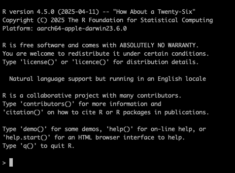
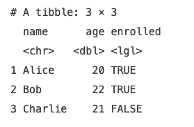

## Lab # 2 Introduction to R

## Table of Contents
1. [Introduction](#intro)
2. [Setting Up](#setup)
3. [Types of Variables](#variables)
4. [Reading in Files](#read)
5. [Manipulating Files](#manipulate)
6. [Plotting](#plot)
7. [Basic Statistics](#stats)
8. [Writing to File](#write)

<a name="intro"></a>
## Introduction

The goal of this lab is to learn basic R. R is a statistical programming language that supports statistical analyses as well as data visualization. The lab will walk through reading in a file, manipulating data and writing the new results to file.

**Flash Updates**
* *Tidyverse* 
* *Wide vs. Long Data* 
* *Boxplot* 


**Links**

**Computer Resources**
* The lab can be completed on the *cluster*. Refer back to Lab 1 to refresh using command line arguments in Linux.

**Grading**
* Questions are for your learning and are not graded
* Problems are worth 5 points each (-1 for each error)
* Submit your answers to the Problems, plus any supplmental multiple choice questions, on **A2L Quizzes** before the deadline
* An answer key to Questions and Problems will be provided on A2L after the deadline

<a name="setup"></a>
## Setting Up

Today’s lab will use the *cluster*. We will be using an interactive node to run R. Refer back to lab 1 on how to request an interact node on *Slurm*. You will only need 2G of memory. Make sure to log out when you are done. 

**Loading R**

To load R, run the following commands. The first makes sure the R software is loaded, the second will boot up R. 

```bash
# load R
module load R
# launch R
R
```

You should now be within the R statistical environment. 



**Loading R libraries**

> Flash Update - Tidyverse

We will be using [*tidyverse*](https://tidyverse.org/) which is a collection of R packages designed for data science.

Tidyverse is already installed within the R module on the cluster, however, if you are running R locally you will first have to install tidyverse. 

```R 
install.packages(tidyverse)
```

If tidyverse is already installed, you just need to load it into your current R environment. 

```R
library(tidyverse)
```

When you want to know more about a command, you can always pull up the manual for a specific command using `?`. For example, to learn more about the `mean` command, run the following:

```R
?mean
```

<a name="variables"></a>
## Types of Variables

In R, you assign a variable using the `<-` operator.

```R
x <- 10
month <- "September"
pi_value <- 3.14
```
Here `x` stores a number, `month` stores text (a string) and `pi_value` stores a decimal number. Variables can hold different types of data.

A few rules of thumb for naming variables:
1. **Do** make variable names informative
2. **Do not** start a variable name with a number
3. **Do not** include a space in a variable, instead use an `_`
4. **Do not** use words that have other functions, e.g. `if`, `for`, `function`

To check the type of data a variable holds, you can run:

```R
class(x) # numeric
class(month) # character
```
Once defined, you can use variables in calculations or expressions:

```R
a <- 5
b <- 3

add <- a + b
product <- a * b

print(add) # 8
print(product) # 15
```
You can change a variable at any point.

```R
x <- 10
x <- x + 5   # Now x is 15
print(x)
```
**Introducing Vectors**

Variables can also hold more than a single datapoint. A vector is a collection of values of the same type. You create vectors using the `c()` function (combine):
```R
numbers <- c(1, 2, 3, 4, 5)
kid_names <- c("Alice", "Bob", "Charlie")
```
You can access different elements in a vector:
```R
numbers[1]   # First element
numbers[3]   # Third element
```

**Introducing Booleans**

A boolean is a data type that has one of two values: True or False. They are often used to evaluate conditions. For example, let's say you have the following vector: 

```R
students <- c("Lisa", "Tony", "Tim", "Jim", "Tina", "Michael")
```

We want to figure out how many students have names that are four letters long. To that we can: 

```R
# first calculate the number of characters in each name
name_length <- nchar(students)
print(name_length)
# now we want to figure out which ones are 4 characters long
length4 <- name_length == 4
# you will notice that we now have TRUE when the name is 4 characters and FALSE if it is not
# to get the total number, we can sum up the number of TRUE
print(sum(length4))

```

In this way, boolean variables can help us identify when specific conditions are met.

**Introducing Tibbles**

A [tibble](https://tibble.tidyverse.org/) is a table (like a spreadsheet), where:
- Each column is a vector
- Each row is an observation

```R
students <- tibble(
  name = c("Alice", "Bob", "Charlie"),
  age = c(20, 22, 21),
  enrolled = c(TRUE, TRUE, FALSE)
)
```
Each column (name, age, enrolled) is a vector.

```R
# viewing the tibble
students 
```


We will be working with tibbles for the majority of the lab.

> Flash Update - Wide vs Long Data

<a name="read"></a>
## Reading in Files

The first step to data analysis is to read in data to R. Here we are going to read in mRNA abundance data. We will be learning about RNA-seq in lab 7 and later using the same dataset in lab 10 to build a machine learning model to predict breast cancer subtypes. 

There are a few common text file types. How the columns are separate matters when reading data into R. How columns are separated in a file can be determined by looking at the file or from the file suffix.

| File Suffix | Description |
| :---: | :--- | 
| .txt | Indicates text file which is often tab separated but not always.|
| .csv | Indicates comma separated values. |
| .tsv | Indicates tab separated values. |

We will be using the file `breast_cancer_rna.txt`. The suffix tells us it is a text file. A quick look indicates it is likely tab separated. We can use the following command to read it into R. 

```R
# read in file
rna <- read_tsv("breast_cancer_rna.txt")
```

To break down this command, `rna` is variable name that we are going to store the data in. The assingment character `<-` tells R to assign the data to `rna`. The command `read_tsv` tells R to read in a file that is tab separated. Within the `read_tsv` command we give the file name to be read in. The file is stored as a tibble.

**Question #1. What happens if you try running the read_tsv command again this time without "" around the filename? Why do you think this happens?**

Now lets look at the data in `rna`.

```R
# look at data
rna
```

**Question 2. What are the columns in the file? What are the rows? How many rows? How many columns?**


<a name="manipulate"></a>
## Manipulating Files

There are a few ways to index columns in R. First we will find all column names.

```R
colnames(rna)
```

There are multiple ways to index columns in R. Let's say we want to pull out mRNA abundance of the estrogen receptor 1 gene (*ESR1*). The follow commands work similarly. 

```R
# index columns using $
esr1_index1 <- rna$ESR1
# index columns using []
esr1_index2 <- rna[,'ESR1']
```

What if we want to index rows instead. For example, what if we want to get the mRNA abundance of all genes for a single individual (e.g. TCGA-4H-AAAK-01A). Similar to the columns, let's start by finding all row names. 

```R
rownames(rna)
```

Currently the row names are not the individual IDs. Those are stored in the first column `CLID` instead. To fix this, we can first make the row names the individual IDs and then use the individuals IDs to subset to our individual of interest. 

```R
# make rownames individual IDs, this takes the column CLID and assigns them as rownames
rownames(rna) <- rna$CLID
# subset to only sample of interest
individual_interest <- rna['TCGA-4H-AAAK-01A',]
```

Notice above, to index columns we added our column name after the `,` where as to index rows we added the row name before the `,` (`rna[rowname,colname]`). 

**Question 3. What is the mean of *ESR1* across all individuals? Hint: look into the command `mean()`.**

Let's say we want to find all individuals that have *ESR1* mRNA abundance above the mean. After we calculate the mean, we could then use a boolean variable to identify the individuals with *ESR1* above the mean. For example: 

```R
# we have already calculate the ESR1 mean 
# we want to find individuals with ESR1 above the mean
high_esr1 <- rna$ESR1 > esr1_mean
# using this boolean we could then find the sample names for the individuals that have ESR1 above the mean
# we do this by indexes the rownames (which are the same names) to only return the rownames where high_esr1 is TRUE
high_esr1_samples <- rownames(rna)[high_esr1]
```

Note: the `!` symbol can be handy if you want the opposite. For example, if we wanted to find all the individuals where *ESR1* mRNA abundance was less than or equal to the mean, we could do the following to return all sample ids where `high_esr1` is FALSE.

```R
low_esr1_samples <- rownames(rna)[!high_esr1]
```

**Problem 1. There are three subtypes of breast cancer. Which subtype an individual develops influences their treatment protocol. The three subtypes are ER+ (defined by the presence of the estrogen receptor, encoded by *ESR1*), HER2+ (defined by the presence of HER2, encoded by *ERBB2*) and triple negative (defined by the absence of both ER and HER2). Based on just *ESR1* and *ERBB2* abundance, assign each sample to one of the three subtypes. Justify your decision.**

<a name="plot"></a>
## Plotting

> Flash Update - Boxplots

A particularly handy plot type to look at the distribution of data is a [boxplot](https://www.atlassian.com/data/charts/box-plot-complete-guide). Boxplots show the distribution of data and are useful when one wants to compare multiple distributions at once on the same plot. 

Let's try making a boxplot to look at the distribution of mRNA abundance for *ESR1* and *ERBB2*. We are going to use the `boxplot` function.

The boxplot function expects long data (not wide data). Take a look at [this blog](https://anvil.works/blog/tidy-data) for more details on the difference between long and wide data. However, our data is currently wide data so we need to transform it to long data.

```R
# to start we need to transform our data from wide to long
plot_data <- pivot_longer(
    data = rna[,c('ERBB2','ESR1')], 
    cols = c('ERBB2','ESR1'), 
    names_to = 'gene', 
    values_to = 'mrna')
# make a boxplot of mRNA abundance (y-axis) by gene (x-axis)
boxplot(mrna ~ gene, data = plot_data)
```

**Problem 2. Create two boxplots, one for *ERBB2* and one for *ESR1*, where the y-axis is the mRNA abundance of the gene while the x-axis are the subtypes you have split individuals into in Problem 1. Does the boxplot support your subtype stratification? Why or why not?**

<a name="stats"></a>
## Basic Statistics

A two-sample t-test compares the mean between groups or between two measurements on the same samples. We can test if the mRNA abundance of *ERBB2* differs from *ESR1*. Because both meaures are on the same samples, this is technically considered a paired t-test.

```R
# run a paired t-test
t.test(rna$ESR1, rna$ERBB2, paired = TRUE)
```
**Question 4. What is the p-value? WHat is the confidence interval? How do you interpret the confidence interval?**

**Problem 3. Is the mRNA abundance of *ERBB2* and *ESR1* statistically different between your subtypes? Does this support your subtype stratification? Why or why not?**

<a name="write"></a>
## Writing to File

If you haven't already, add a new column to the `rna` tibble that indicates the subtype (ER, HER2 or TNBC) for each individual. Finally, we want to write our subtype assignments to file. We will be comparing back to them later in Lab 10. 

```R
# write to file 
write.table(
    rna,
    file = "breast_cancer_rna_with_subtype.txt",
    sep = "\t", # this tells R to write the file as tab separated
    quote = FALSE # this parameter tells R not to quote characters
)
```
