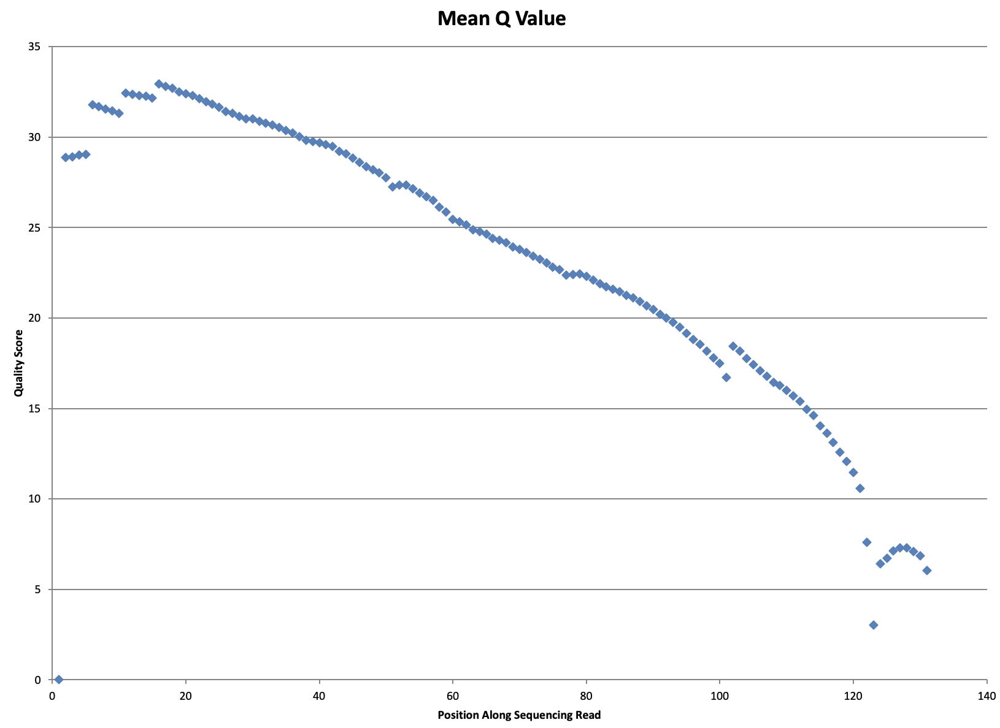
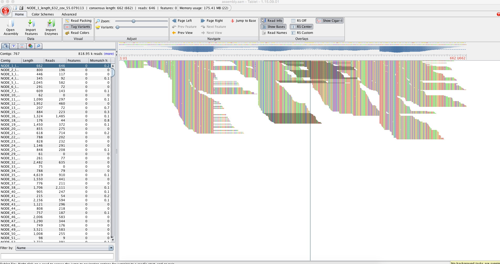
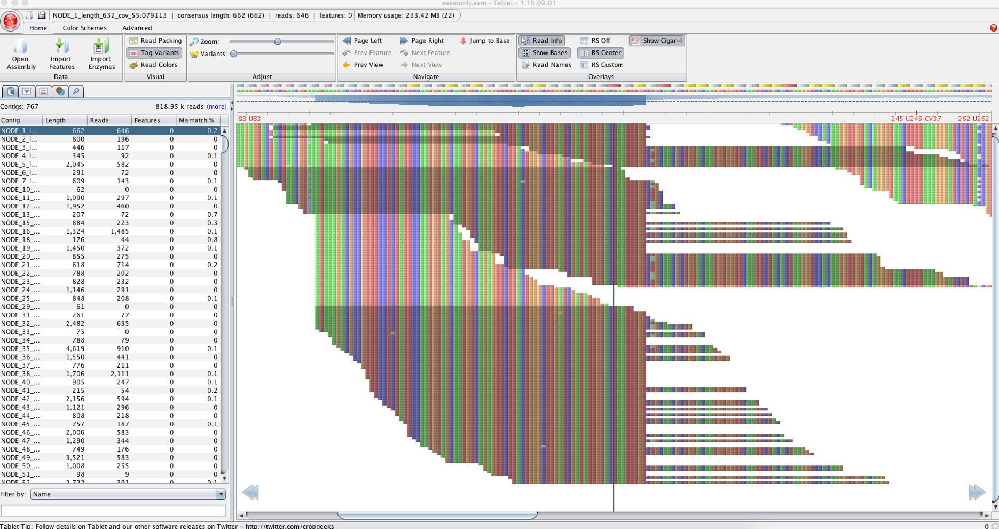
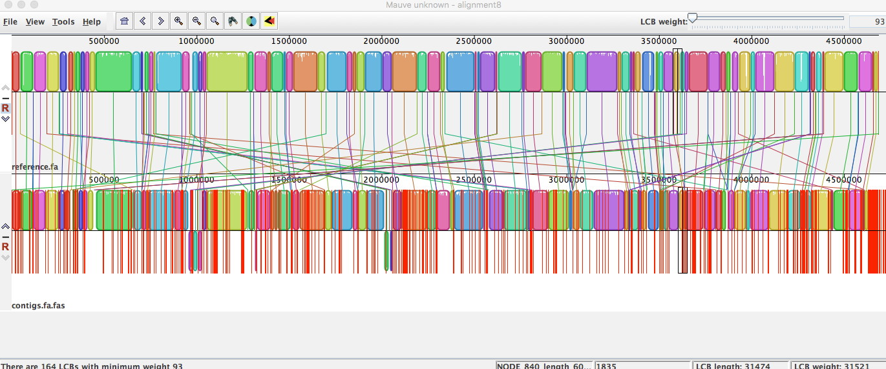

## Lab # 6 - FASTQ and Genome Assembly

## Table of Contents
1. [Introduction](#intro)
2. [Command Line Genome Assembly](#velvet)
3. [Visualization](#visual)
4. [Galaxy](#galaxy)

<a name="intro"></a>
## Introduction

The goal of this lab is to improve student usage of the Linux operating system and the *command line*, in the context Illumina FASTQ DNA sequencing data and microbial genome assembly. 

**Lectures** - [Lecture 6 slides](https://github.com/agmcarthur/Biochem-3BP3/blob/master/Lectures/Lecture%206%20-%20Genome%20Assembly.pptx) DNA Sequencing & Genome Assembly [~50 minute video](https://mcmasteru365-my.sharepoint.com/:v:/g/personal/mcarthua_mcmaster_ca/EUJI1KVG_nNDjlKZ6V57k6EB8cvcCFpzx8JR9s_2ybraEQ)

**Flash Updates**
* *Illumina Sequencing* 
* *FASTQ* 
* *N50* 

**Demo Videos**
* [Using Microsoft Remote Desktop](https://mcmasteru365-my.sharepoint.com/:v:/g/personal/mcarthua_mcmaster_ca/EW0MD7r2VKNLiF9NcTSWalIBjrQKxeVJVoo6DCF06gFWUQ) ~2 minutes
* [De Bruijn graph walkthrough](https://mcmasteru365-my.sharepoint.com/:v:/g/personal/mcarthua_mcmaster_ca/Efjr1LXuDp9MiqUjpzESEzMBMAPkDonE1UrmdA8Bn9O70A) ~6 minutes
* [Command Line Genome Assembly walkthrough](https://mcmasteru365-my.sharepoint.com/:v:/g/personal/mcarthua_mcmaster_ca/EbLIyE4ES29ArXkBhoSOLJAB_MX-x3gojUGq1kq7KJm0RQ) ~27 minutes


**Background Reading** (optional)
* Myers et al. 2000. A whole-genome assembly of *Drosophila*. [Science 287:2196-2204](https://www.ncbi.nlm.nih.gov/pubmed/?term=10731133)
* Pop. 2009. Genome assembly reborn: recent computational challenges. [Brief Bioinform. 10:354-66](https://www.ncbi.nlm.nih.gov/pubmed/?term=19482960)
* Tritt et al. 2012. An integrated pipeline for *de novo* assembly of microbial genomes. [PLoS One. 7:e42304](https://www.ncbi.nlm.nih.gov/pubmed/?term=23028432)

**Computer Resources**
* This lab will use McMaster's virtual Windows servers, so you need to install and set-up [Microsoft Remote Desktop](https://uts.mcmaster.ca/services/teaching-and-learning/computer-labs/#tab-content-how-to-connect) on your personal computer. See the demo video on how to login using Microsoft Remote Desktop and your MacID.
* All files and work on the virtual servers will be lost when you log out. Be sure to save your work elsewhere (e.g., email yourself a copy).
* We will also be using the cluster in today's lab
* A reminder to log in you must be on the McMaster network or VPN

```bash
ssh -l <macid> acf-access-student.csu.mcmaster.ca
```

**Grading**
* Questions are for your learning and are not graded
* Problems are worth 5 points each (-1 for each error)
* Submit your answers to the Problems, plus any supplmental multiple choice questions, on **A2L Quizzes** before the deadline
* An answer key to Questions and Problems will be provided on A2L after the deadline


<a name="assembly"></a>
## Command Line Genome Assembly

> Flash Update - Illumina Sequencing

> Flash Update - FASTQ 


We are going to perform a command line assembly of a *Salmonella* genome that was sequenced using the Illumina platform using a kmer assembler called VELVET.

Download the following FASTQ files and upload to the cluster:
[Salmonella_3185_TACGAATC_L003_R1_001.fastq.gz](https://dl.dropboxusercontent.com/s/30cagee5w63dvwq/Salmonella_3185_TACGAATC_L003_R1_001.fastq.gz)
[Salmonella_3185_TACGAATC_L003_R2_001.fastq.gz](https://dl.dropboxusercontent.com/s/pm622bu70er1l71/Salmonella_3185_TACGAATC_L003_R2_001.fastq.gz)

```bash
# files can be downloaded directly to the cluster using wget
wget https://dl.dropboxusercontent.com/s/30cagee5w63dvwq/Salmonella_3185_TACGAATC_L003_R1_001.fastq.gz
wget https://dl.dropboxusercontent.com/s/pm622bu70er1l71/Salmonella_3185_TACGAATC_L003_R2_001.fastq.gz
```

**Question #1. These two files contain the *forward*  (R1) and *reverse* (R2) sequencing reads of this genome sequencing project. Given that the following command will tell you how many lines are in a file, how many DNA molecules have been sequenced and how many sequences are there?**

```bash
zcat Salmonella_3185_TACGAATC_L003_R1_001.fastq.gz | wc -l 
```

Take a look at one of the FASTQ files to remind yourself of the format and how sequencing quality is encoded:

```bash
zless Salmonella_3185_TACGAATC_L003_R1_001.fastq.gz
```

We have installed software from the FASTX-Toolkit (http://hannonlab.cshl.edu/fastx_toolkit/index.html) to perform some quality control steps on these data before assembling the genome. Let’s first look at how quality varies along the sequences:

```bash
zcat *.fastq.gz | fastx_quality_stats -Q33 -o sequences.stats
```

You needed to add the -Q33 parameter to tell it that you're using Illumina encoded quality scores, not Sanger encoding. First take a look at the contents of *sequences.stats* using the command line and then download the pre-calculated EXCEL spreadsheet in A2L/GitHub to view on your computer. You can find a key to the column labels here: http://hannonlab.cshl.edu/fastx_toolkit/commandline.html#fastq_statistics_usage



**Question #2. Looking at the plot, we want trim the reads where the average quality becomes worse than a 1 in 100 error rate (Q20). At what position along the read on average would you trim the data?**

Now trim the reads by length using the following command, but replace the word POSITION with the value you decided above (*-f* is first position to keep, *-l* is last position to keep):

```bash
zcat *.fastq.gz | fastx_trimmer -Q33 -f 1 -l POSITION > sequences.trim
```

We now want to additionally clip and filter the reads. The clipping removes the synthetic Illumina DNA adaptor sequence *TACGAATC* while the filter removes any reads of length less than 32 bp after removal of the adaptor. We pick 32 bp as when we assemble we will be using 31 bp kmers. The *-v* is for verbose mode, giving a summary of the results.

```bash
fastx_clipper -Q33 -l 32 -v -a TACGAATC -i sequences.trim -o sequences.clip
```

**Question #3. How many sequences passed this filter?**

Lastly, we want to perform a quality filter, such that we only keep sequencing reads for which at least 95% of bases are Q20 or better:

```bash
fastq_quality_filter -Q33 -q 20 -p 95 -v -i sequences.clip -o sequences.filter
```

**Question #4. How many sequences passed this quality filter?**

Now look at the results to see how the data have changed:

```bash
less sequences.filter
```

**FASTQC**

We can also use FASTQC to determine the quality of our data. Details on all the plots can be found here: [FASTQC Documentation](https://www.bioinformatics.babraham.ac.uk/projects/fastqc/Help/3%20Analysis%20Modules/) and [video tutorial](http://www.youtube.com/watch?v=bz93ReOv87Y).

```bash
# run fastqc on original fastq files
fastqc Salmonella_3185_TACGAATC_L003_R1_001.fastq.gz
fastqc Salmonella_3185_TACGAATC_L003_R2_001.fastq.gz
```

Here is an example of the **Per base sequence quality** from another data set:


For each sequenced nucleotide (start of read to end of read) a BoxWhisker type plot is drawn. The elements of the plot are as follows:

* The central red line is the median value
* The yellow box represents the inter-quartile range (25-75%)
* The upper and lower whiskers represent the 10% and 90% percentiles
* The blue line represents the mean quality

The y-axis on the graph shows the quality scores. The higher the score the better the base call. The background of the graph divides the y axis into very good quality calls (green), calls of reasonable quality (orange), and calls of poor quality (red). The quality of calls on most platforms will degrade as the run progresses, so it is common to see base calls falling into the orange area towards the end of a read.

**Question #5. In your *Salmonella* data, at what position along the reads does the mean quality fall below Q20? Is it the same for both the forward and reverse reads?**

**Question #6. After reading the documentation on the FASTQC plots, do you think there is any evidence that the sequence library is biased (i.e. non-random)? Explain your reasoning.**

```bash
# run fastqc on trimed and quality filtered data
fastqc sequences.filter
```

**Question #7. How does the trimmed and quality filtered FASTQ data differ from the original FASTQ data? How will the trimming improve your assembly?**


The original data were paired reads (i.e. forward & reverse) but some of the pairs may have been lost by the filtering. The Velvet assembly algorithm treats paired and unpaired reads differently as only the former can create scaffolds, so we need to put these in different files using one of Dr. McArthur’s Perl scripts:

```bash
fastq_interleave sequences.filter
ls
```

**Question #8. How many paired and unpaired reads are in the final pre-assembly data?**

**Question #9. This strain of *Salmonella* is expected to be ~4,600,000 bp in size. What base pair coverage are we about to submit to the Velvet assembly?** 

> Flash Update - N50

We are now going to use the Velvet assembly to make contigs and scaffolds. First we need to make an assembly directory and then calculate the kmers present in the sequencing reads. The Velvet algorithm requires the kmer value to be an odd number to avoid palindromes. Longer kmers bring more specificity, but lower coverage. The Velvet package has been found to perform well with kmer length of 31 bp:

```bash
mkdir draft_assembly
velveth draft_assembly 31 \
    -fastq \
    -shortPaired sequences.filter.paired \
    -short sequences.filter.unpaired
```

With the kmer sequences and their frequencies now calculated, we can have Velvet determine the de Bruijn graph for these sequencing reads and use the Eulerian path to resolve contigs. The paired reads will then be used to create scaffolds among the contigs. We are going to let the Velvet assembler determine the expected kmer coverage from the data itself and thus determine the minimum coverage cut-off for forming contigs. Once the assembly is done, we will use one of Dr. McArthur’s Perl scripts to summarize the results:

```bash
# run assembly
velvetg draft_assembly \
    -cov_cutoff auto \
    -exp_cov auto
# calculate stats on assembled contigs
scaffoldstats draft_assembly/contigs.fa
```

**Question #10. If you browse through the output, how many kmers were found in the sequencing data?**

**Question #11. What fraction of the sequencing reads contributed to the final assembly?**

**Question #12. The Final Graph in Velvet refers to the contig sequences, whereas the output of scaffoldstats refers to scaffolds. Is the N50 higher for the scaffolds than the contigs? Why?**

**Question #13. Why is the final estimated coverage lower than what we estimated in Question 6?**

Record some statistics for later comparison:

* Total number of scaffolds:
* Total scaffold assembly length (bp):
* Scaffold N50 (bp):
* Largest scaffold (bp):

<a name="visual"></a>
## Visualization

We now want to visualize our assembly instead of just looking at statistics. Some of these results are pre-computed screenshots since the analyses are not quick and we are going to learn the details of Burrow's Wheeler Transform next week.

> Visualizing BWT read mapping was performed using Tablet, https://ics.hutton.ac.uk/tablet/

_We use the Burrows-Wheeler algorithm (BWA) to align our raw sequencing reads to the assembled contigs so we can see where each read contributed to the final assembly. Usually, BWA is used to align NGS sequences to a reference genome, such as the published human genome. In this case, we are using the contigs as the reference genome. Visualizing reads that aligned to the contig *Node 1*:_



_Zoom of above image to show agreement (and rare disagreement) among sequencing reads. The disagreement could be true polymorphism or sequencing errors:_



> Visualizing similarity between assembly and a reference *Salmonella* genome was performed using MAUVE, http://darlinglab.org/mauve/mauve.html

_Comparison of the assembly contigs (bottom) to the complete genome sequence of a reference *Salmonella* strain (top). Blocks reflect regions of shared sequence, red lines gaps:_



Lastly, visualize the quality of the assembly graph, with an emphasis upon repeated sequences, using BANDAGE (https://rrwick.github.io/Bandage) and the *LastGraph.txt* file available on A2L/GitHub. BANDAGE can be accessed through the Microsoft Remote Desktop.

**Problem #1. Based on the Tablet, MAUVE, and BANDAGE results, what is your assessment of the quality of your genome assembly?**

**UNICYCLER ASSEMBLY**

We used the older assembler VELVET and in the lecture we learned about the all-in-one microbial assembler A5.  We are going to perform our final assembly using the Unicycler assembler, which is considered the best for kmer based assembly. 

First we need to de-interlace the FASTQ file.: 

```bash
./deinterleave_fastq.sh < sequences.filter.paired sequences.filter_R1.fastq sequences.filter_R2.fastq
```

Unicycler has powerful defaults, so perform the Unicycler assembly using the FASTQ De-Interlacer results and without changing any of the parameters:

```bash
mkdir unicycler
unicycler \
    -1 sequences.filter_R2.fastq \
    -2 sequences.filter_R1.fastq \
    -o unicycler_v2
```

**VISUALIZATION AND STATISTCS**

Unicycler will create two main files, one containing the assembly graph and they other the contig FASTA sequences. Download the Unicycler assembly graph file (assembly.gfa) and use BANDAGE (https://rrwick.github.io/Bandage) to visualize the assembly. BANDAGE can be accessed on the Microsoft Remote Desktop.

We can also use the **Quast** tool to generate assembly statistics, reading the PDF report to view the assembly statistics:

```bash
quast.py unicycler/assembly.fasta \
    -t 1 \
    -o unicycler/
```

**INTERPRETATION**

Using the Quast results and the BANDAGE plot to answer the following questions:

**Problem #2. Based on the statistics above, do you think this is a high quality assembly of a *Salmonella* genome? Explain your reasoning.**

**Problem #3. Compare this assembly to the command-line Velvet assembly. The Unicycler assembly had more FASTQ data and a better algorithm, but what specifically improved in the assembly?**
