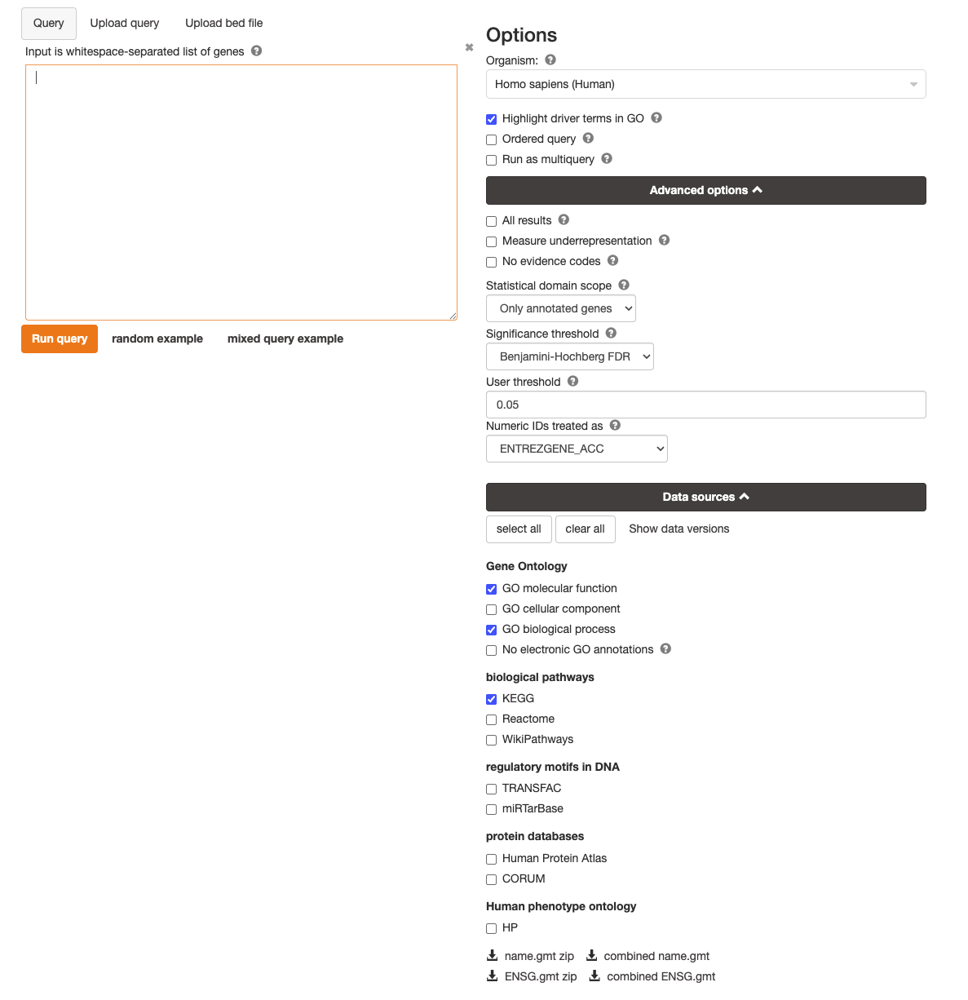

## Lab # 9 RNA-Seq

## Table of Contents
1. [Introduction](#intro)
2. [Setting Up](#setup)
3. [The Experiment](#experiment)
4. [Data Cleaning](#clean)
5. [Mapping Reads to the Human Genome](#mapping)
6. [Transcript Assembly](#transcripts)
7. [Differential Gene Expression Analysis](#dge)
8. [Interpretation](#interpretation)

<a name="intro"></a>
## Introduction

The goal of this lab is to review the analysis of RNA-Seq data.

**Lectures** - [Lecture 9](https://github.com/agmcarthur/Biochem-3BP3/blob/master/Lectures/Lecture%208%20-%20RNA-Seq.pptx) RNA-Seq, ChIP-Seq, Bisulfite-Seq ([~34 minute video](https://mcmasteru365-my.sharepoint.com/:v:/g/personal/mcarthua_mcmaster_ca/EcZMiU9kvzNEsvLCbkX9aiAB92qPdecMT2-SbmjLDGtPUg))

**Flash Updates**
* *RNA-Seq* 
* *Illumina Bead Microarrays* 
* *Tn-Seq* 

**Demo Videos**
* [Set-Up & Data Cleaning](https://mcmasteru365-my.sharepoint.com/:v:/g/personal/mcarthua_mcmaster_ca/EaUn4n_JRlhFrcSJiVhg9cYBWzv_sJPX6pBDC2ENcfh3eg) ~11 minutes
* [Read Mapping](https://mcmasteru365-my.sharepoint.com/:v:/g/personal/mcarthua_mcmaster_ca/ESvw9oUNBwtIg7dO_PMATlMBmbZ6aPhZ4SBuiKqQXbxIig) ~4 minutes
* [Transcript Assembly](https://mcmasteru365-my.sharepoint.com/:v:/g/personal/mcarthua_mcmaster_ca/EcbU-9ZwW2BKhMKQanVXkEgBxt4BZxP0My4mj3SzReYCtw) ~6 minutes
* [Differential Gene Analysis & Interpretation](https://mcmasteru365-my.sharepoint.com/:v:/g/personal/mcarthua_mcmaster_ca/Ee8IQz_I8c9BiFfZ-98JSksBY30ATte94sccEwi2aoX6Wg) ~13 minutes


**Links**


**Computer Resources**
* The lab can be completed on the *cluster*. Refer back to Lab 1 and 4 to refresh using command line arguments in Linux and R.

**Grading**
* Questions are for your learning and are not graded
* Problems are worth 5 points each (-1 for each error)
* Submit your answers to the Problems, plus any supplmental multiple choice questions, on **A2L Quizzes** before the deadline
* An answer key to Questions and Problems will be provided on A2L after the deadline

<a name="qc"></a>
## Setting Up

Today’s lab will use the *cluster* . Upload all the data files via the Paste/Fetch tool (manually indicating the file type):

**Annotation (GTF format) File(s):**

```
https://dl.dropboxusercontent.com/s/cr7u5npcqj6xp5w/gencode.v29.annotation.gtf.gz?dl=0
```

**Illumina Sequencing (FASTQ format) Files(s):**

```
https://dl.dropboxusercontent.com/s/ng1qit5698hra02/adrenal.fastq?dl=0
https://dl.dropboxusercontent.com/s/qgig0gsegvmkgs7/HLE_Cd_1_forward.fastq.gz?dl=0
https://dl.dropboxusercontent.com/s/cushi8ut6mfb1ph/HLE_Cd_1_reverse.fastq.gz?dl=0
https://dl.dropboxusercontent.com/s/vpjl91pa2myciwi/HLE_Cd_2_forward.fastq.gz?dl=0
https://dl.dropboxusercontent.com/s/epdxowzgc7biglt/HLE_Cd_2_reverse.fastq.gz?dl=0
https://dl.dropboxusercontent.com/s/e6vgsls07scm3re/HLE_Cd_3_forward.fastq.gz?dl=0
https://dl.dropboxusercontent.com/s/5x1lw926ftljpgr/HLE_Cd_3_reverse.fastq.gz?dl=0
https://dl.dropboxusercontent.com/s/7927y0q1qf6l9at/HLE_Ctrl_1_forward.fastq.gz?dl=0
https://dl.dropboxusercontent.com/s/rcy4wjswr9xfzwm/HLE_Ctrl_1_reverse.fastq.gz?dl=0
https://dl.dropboxusercontent.com/s/3478jpj8mlpa9im/HLE_Ctrl_2_forward.fastq.gz?dl=0
https://dl.dropboxusercontent.com/s/gbsv0594lw1ncl0/HLE_Ctrl_2_reverse.fastq.gz?dl=0
https://dl.dropboxusercontent.com/s/9re3pkjfkv4odj6/HLE_Ctrl_3_forward.fastq.gz?dl=0
https://dl.dropboxusercontent.com/s/czyd9wdrih4givw/HLE_Ctrl_3_reverse.fastq.gz?dl=0
```

<a name="experiment"></a>
## The Experiment

> Flash Update - RNA-Seq

We are going to examine the response of the human transcriptome in a human lens epithelial cell line (part of the eye) exposed to Cadmium, as preliminary microarray work has suggested Cadmium exposure, via the MTF-1 transcription factor, impacts lens development and maintenance. The experiment is RNA-Seq of three Cadmium exposed replicates and 3 Control replicates, using the GRCh38 version of the human genome annotation as reference. The RNA-Seq was performed using an Illumina HiSeq with 2 x 50 bp mate pair sequencing.

We are going to start by using the FastQC tool to examine the quality of some of the RNA-Seq data. Details on all the plots can be found here: [FASTQC Documentation](https://www.bioinformatics.babraham.ac.uk/projects/fastqc/Help/3%20Analysis%20Modules/) and [video tutorial](http://www.youtube.com/watch?v=bz93ReOv87Y).

```bash
# create directory to store initial fastqc run
mkdir raw_fastqc
# run fastqc on foward fastq
fastqc HLE_Cd_1_forward.fastq.gz
# move output into folder
mv HLE_Cd_1_forward_fastqc.html raw_fastqc/
mv HLE_Cd_1_forward_fastqc.zip raw_fastqc/
```

**Question #1. How many mRNA were sequenced from each replicate and does this data need any adaptor removal or quality trimming?**

**Problem #1. This lab is using only a fraction of the total data so it does not take too long, but also perform FASTQC on the full replicate from a different experiment (adrenal.fastq). When a full RNA-Seq run is analyzed, do the samples pass FastQC's quality control checks for per-sequence GC content and sequence duplication levels? These checks passed when we were assembling bacterial genomes. If they do not pass for these RNA-Seq data, suggest reasons.**

<a name="clean"></a>
## Data Cleaning

Even if the data as a whole passed FASTQC, quality trimming and filtering is still highly recommended to remove or trim individual sequences of poor quality. Run *Trimmomatic* (paired-end with separate input files, plus ILLUMINACLIP with TruSeq3 for paired-end MiSeq or HiSeq) on all the samples. For example:

```bash
# create directory to store trimmed data in
mkdir trimmomatic
# run trimmomatic in paired-end mode
trimmomatic PE -threads 1 \ # uses a single thread
HLE_Cd_1_forward.fastq.gz \ # input fastq forward
HLE_Cd_1_reverse.fastq.gz \ # input fastq reverse
trimmomatic/HLE_Cd_1_forward_trimmed_paired.fq.gz \ # output paired fastq forward
trimmomatic/HLE_Cd_1_forward_trimmed_unpaired.fq.gz \ # output unpaired fastq forward
trimmomatic/HLE_Cd_1_reverse_trimmed_paired.fq.gz \ # output paired fastq reverse
trimmomatic/HLE_Cd_1_reverse_trimmed_unpaired.fq.gz \ # output unpaired fastq reverse
ILLUMINACLIP:TruSeq3-PE.fa:2:30:10:8:True \ # trims adapter
SLIDINGWINDOW:4:20 # trims low quality bases
```

`ILLUMINACLIP:TruSeq3-PE.fa:2:30:10` removes the adapters for Illumina TruSeq3 sequencing which is the method used to generate these data. 

`SLIDINGWINDOW:4:15` scans the read with a 4-base wide sliding window, cutting where the average quality per base drops below 15.

**Note**: Trimmomatic under these settings creates both **paired** and **unpaired** output. We only want to use paired reads in our data, so will ignore the unpaired files.

**Question #2. Run *FASTQC* on a couple of your samples to see if the data has changed in quality. Has anything improved?**


> Flash Update - Illumina HT-12

<a name="mapping"></a>
## Mapping Reads to the Human Genome

Before we can interpret these data, we need to map the FASTQ reads to the reference human genome (hg38). We cannot use the standard Burrows-Wheeler Transform software BWA or Bowtie, since RNA-Seq data needs to be corrected for introns and exons. Instead, we will use [HISAT2](https://daehwankimlab.github.io/hisat2/main/), which can handle splice junction boundaries as well as control for fragment sizes.

The first step is download the [reference files](https://daehwankimlab.github.io/hisat2/download/) required by *HISAT2*. 

```bash
# create directory to alignments
mkdir hisat2
mkdir hisat2/genome_dir
# navigate to directory
cd hisat2/genome_dir
# download reference files
wget https://genome-idx.s3.amazonaws.com/hisat/grch38_genome.tar.gz
# extract files
tar -xvf grc38_genome.tar.gz
```

Perform *HISAT2* read mapping for each sample, using the reference files you just downloaded. The command is provided below, however, please submit as a job to slurm. **Do not run on head node.** It is recommended to run the alignment with 6GB of memory requested. As a reminder of how to create a *sbatch script* please refer back to Lab 1. 

```bash
# run HISAT2 to align reads to reference genome
hisat2 --add-chrname -x hisat2/genome_dir/grch38/genome \
-1 trimmomatic/HLE_Cd_1_forward_trimmed_paired.fq.gz \
-2 trimmomatic/HLE_Cd_1_reverse_trimmed_paired.fq.gz \
-S hisat2/HLE_Cd_1.sam
```

The [SAM](https://samtools.github.io/hts-specs/SAMv1.pdf) output is standard file format for sequencing alignment. However, the SAM file format is uncompressed and can take up a lot of space. Thus, we can convert SAM files to BAM files which are the binary equivalent.

```bash
# convert sam file to bam file
samtools view -bS hisat2/HLE_Cd_1.sam > hisat2/HLE_Cd_1.bam
# once the file is coverted, we can remove the original sam file
rm hisat2/HLE_Cd_1.sam
```


Finally, we need to assess our alignment. By default, *HISAT2* provides information on alignment to the *standard out*.


> Flash Update - Tn-Seq

**Problem #2. STAR creates a BAM file that contains the alignment information. What percentage of read pairs aligned uniquely to one location in the genome and what percentage may represent multiple copy genes? What was the overall alignment rate? Would you say this is a good RNA-Seq data set? Why?**

<a name="transcripts"></a>
## Transcript Assembly

Now that the raw RNA-Seq data have been aligned to the reference human genome, we can assemble the data into individual transcripts as a step towards identifying differential gene expression (DGE). The *htseq-count* tool determines the transcripts at each gene in the reference and provides un-normalized counts.

Perform *featureCounts* on each replicate's *HISAT2* BAM file, using the *gencode.v29.annotation.gtf.gz* annotation file and the *Reverse* stranded option (which reflects use of a first-strand synthesis kit during library construction, see [PMID 32415774](https://pubmed.ncbi.nlm.nih.gov/32415774/)). Reverse strandedness can be implemented in featureCounts using the parameter `-s 2`. For example:

```bash
# create new output directory
mkdir feature_counts
# run feature counts 
featureCounts -p -a gencode.v29.annotation.gtf \
-o feature_counts/HLA_Cd_1_feature_counts.txt \
-s 2 \
hisat2/HLE_Cd_1.bam
```

**Question #3. Examine the results of featureCounts. How many total transcripts are quantified? Write a simple R script to determine how many transcript have 3 or more reads mapped to them. What proportion of transcripts have at least 3 reads?**

Repeat the above steps for the remaining samples.

<a name="dge"></a>
## Differential Gene Expression Analysis

We are going to use *DESeq2* to both normalize and perform significance tests on these data. To do this, we can run the script `run_deseq2.R`.

```bash
# run DESeq2
Rscript run_deseq2.R
```

*DESeq2* will create a results file that included significance testing (using the P-adj to reflect correction for false discovery), a principal components plot to visualize differences in overall transcriptome among the replicates, and a table of normalized counts.

**Question #4. Look at transcript differential expression testing and then try filter in R for significant differences in transcript abundance (P-adj < 0.05). How many genes are differentially expressed in this experiment at this corrected alpha value?**

**Question #5. Look at the normalized counts and then try sort in R to determine the most highly expressed gene in Cadmium exposed cells. Is it the same for each replicate?**

<a name="interpretation"></a>
## Interpretation

At this point, we have a robust statistical analysis of these RNA-Seq data, with a resulting list of significantly differentially expressed genes, that are labeled using *ENSEMBL_GENE_ID* identifiers. We will be using [gProfiler](https://biit.cs.ut.ee/gprofiler/gost) to provide some biological context. gProfiler identifies biological pathways that are enriched more than expected amongst the list of differentially expressed genes.

Take your list of differentially abundance transcript (Question 4) and paste them into the input box on the gProfiler page. Set the parameters according to the screenshot below. In this case, we will just be considering the KEGG pathways and pathways will be considered significant if FDR < 0.05.



**Problem #3. What is your overall interpretation of the impact of Cadmium on human lens epithelial cells?**

